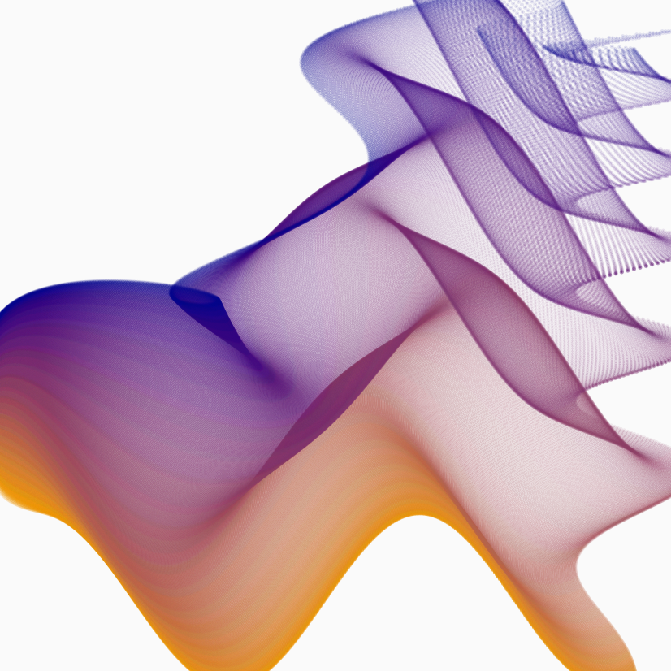
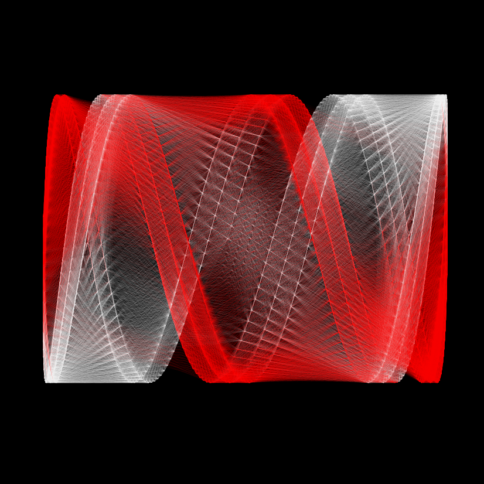
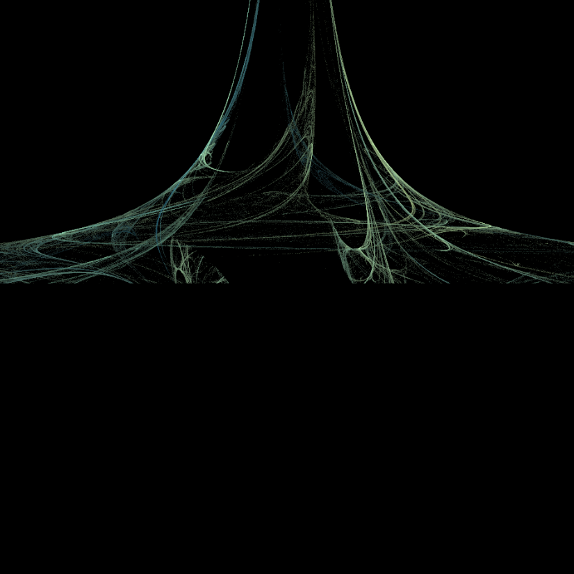

```{r setup, include=FALSE}
knitr::opts_chunk$set(echo = FALSE)
```

```{r}
# formula1=list(
#   x = quote(x_i^2 - sin(y_i^x_i)),
#   y = quote(y_i^sqrt(x_i) + cos(x_i^2))
#   )
# artwork3=canvas_function(colors=c("orange2","darkblue"),formula=formula1,by=.005,polar=FALSE)
# saveCanvas(artwork3,filename="bucknellSurface.png")
```
Bucknell Themed Piece


```{r}
# set.seed(890456094)
# artwork1=canvas_lissajous(colors=c("red","white"),iterations=5,neighbors=100)
# saveCanvas(artwork1, filename = "r&wcoil.png")
```
"The Slinky"



```{r}
# set.seed(1248912)
# artwork2=canvas_flame(colors=colorPalette("sky"),variations=10,gamma=1.1)
# saveCanvas(artwork2, filename = "spaceelevator.png")
```
"Space Elevator"

